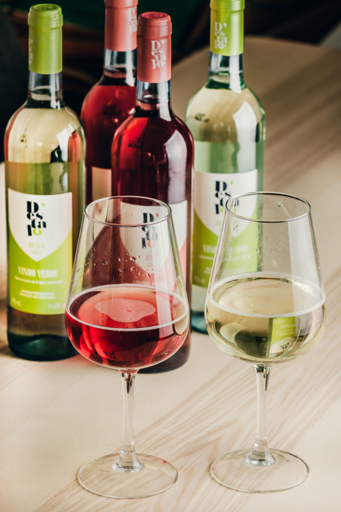

<span style="color:blue; font-family:Georgia ; text-align:justify ; font-size:2em">Exploration of Red Wine Data by Mohamed Hassan</span>

<p align="center">   </p>
______________________________________________________________________________________________________________________________________________________

#### **Introduction**

<p align="justify"> In this project we will explores the univariate, bivariate, & multivariate relationships between variables using Exploratory Data Analysis (EDA) techniques in R. To do so we are going to use a 
[tidy data](http://vita.had.co.nz/papers/tidy-data.pdf) 
that is created - using red wine samples - on 2009 by P.cortez and al, the dataset is related to variants of the Portuguese 
["Vinho Verde"](https://en.wikipedia.org/wiki/Vinho_Verde) wine.</p>

#### **About the Dataset**
This dataset is public available for research. The details are described in [Cortez et al., 2009].

<p align="justify"> P. Cortez, A. Cerdeira, F. Almeida, T. Matos and J. Reis. 
Modeling wine preferences by data mining from physicochemical properties.
In Decision Support Systems, Elsevier, 47(4):547-553. ISSN: 0167-9236.</p>

Available at:

- [Elsevier](http://dx.doi.org/10.1016/j.dss.2009.05.016)
- [Pre-press (pdf)](http://www3.dsi.uminho.pt/pcortez/winequality09.pdf)
- [bib](http://www3.dsi.uminho.pt/pcortez/dss09.bib)

#### **Number of Instances**: Red Wine - 1599 obersvations 

#### **Number of Attributes**: 11 + output attribute

#### **Variable Description**

- **Fixed acidity**: most acids involved with wine or fixed or nonvolatile  (do not evaporate readily).
- **Volatile acidity**: the amount of acetic acid in wine, which at too high of levels can lead to an unpleasant, vinegar taste.
- **Citric acid**: found in small quantities, citric acid can add 'freshness' and flavor to wines.
- **Residual sugar**: <p align="justify"> the amount of sugar remaining after fermentation stops, it's rare to find wines with less than 1 gram/liter and wines with greater than 45 grams/liter are considered sweet.</p>
- **Chlorides**: the amount of salt in the wine.
- **Free sulfur dioxide**: <p align="justify">the free form of SO2 exists in equilibrium between molecular SO2 (as a dissolved gas) and bisulfite ion; it prevents microbial growth and the oxidation of wine.</p>
- **Total sulfur dioxide**: <p align="justify"> amount of free and bound forms of S02; in low concentrations, SO2 is mostly undetectable in wine, but at free SO2 concentrations over 50 ppm, SO2 becomes evident in the nose and taste of wine.</p>
- **Density**: the density of water is close to that of water depending on the percent alcohol and sugar content.
- **pH**: describes how acidic or basic a wine is on a scale from 0 (very acidic) to 14 (very basic); most wines are between 3-4 on the pH scale.
- **Sulphates**: a wine additive which can contribute to sulfur dioxide gas (S02) levels, which acts as an antimicrobial and antioxidant.
- **Alcohol**: the percent alcohol content of the wine.
- **Quality**: output variable (based on sensory data, score between 0 and 10).

#### **Variable Information**

--  **Input variables (based on physicochemical tests):**

- fixed acidity (tartaric acid - g / dm^3)
- volatile acidity (acetic acid - g / dm^3)
- citric acid (g / dm^3)
- residual sugar (g / dm^3)
- chlorides (sodium chloride - g / dm^3
- free sulfur dioxide (mg / dm^3)
- total sulfur dioxide (mg / dm^3)
- density (g / cm^3)
- pH
- sulphates (potassium sulphate - g / dm3)
- alcohol (% by volume)

--  **Output variable (based on sensory data):**

- quality (score between 0 and 10)


#### **What property makes good red wine?** 
- In this project we try to answer this question by exploring the red wine dataset.

```{r echo=FALSE, message=FALSE, warning=FALSE, packages}
# Load all of the packages that you end up using
# in your analysis in this code chunk.
# Notice that the parameter "echo" was set to FALSE for this code chunk.
# This prevents the code from displaying in the knitted HTML output.
# You should set echo=FALSE for all code chunks in your file.
library(ggplot2)
library(GGally)
library(gridExtra)
library(dplyr)
library(RColorBrewer)
library(lattice)
library(MASS)
library(memisc)
```

```{r echo=FALSE, Load_the_Data}
# Load the Data
redwine<-read.csv('wineQualityReds.csv')
head(redwine,10)
```
#### **Feature Names and Summary Statistics**

Let's run some basic functions to examine the structure and schema of the dataset.

```{r echo=FALSE, observations_variables}
str(redwine)
```

This red wine dataset contains 1,599 obersvations with 13 variables on the chemical properties of the wine.

```{r echo=FALSE, summary}

summary(redwine)
``` 

```{r echo=FALSE, Creating_new_variable_Rating }

#Transforming Quality from an Integer to a Factor:
redwine$quality <- factor(redwine$quality, ordered = T)

#Creating a new Factored Variable called 'Rating':
#Ref:https://www.datamentor.io/r-programming/ifelse-function/
redwine$rating <- ifelse(redwine$quality < 5, 'Bad', ifelse(redwine$quality < 7, 'Average', 'Good'))
redwine$rating <- ordered(redwine$rating,levels = c('Bad', 'Average', 'Good'))
``` 

#### <span style="color:darkblue">**Univariate Plots Section**</span>

<p align="justify">  In order to catch the meaning of each variable in the dataset, in this section we will seek to explore each attribute individually in what is known as univariate analysis. The most relevant attributes of this dataset are consolidated at the end of this section.</p>


####  **Quality Distribution**

<p align="justify"> The wine quality grade is a discrete number. from summary statistics and plot the distribution of red wine qualityis ranged from 3 to 8. The median value is at 6.In this sample, there were no evaluations lower than 3 or greater than 8. 
Where, 3.93% were evaluated with low scores (below 5), 82.50% were evaluated with average scores (5 and 6) and 13.57% were evaluated with high scores (above 6).</p>

```{r echo=FALSE, Quality_Distribution, fig.align ='center'}
#Ref:https://stackoverflow.com/questions/40675778/center-plot-title-in-ggplot2
ggplot(aes(x = quality),data = redwine) +scale_x_discrete(breaks = seq(3,8,1))+
  geom_bar(width = 1, color = 'black',fill = I('#099DD9'))+
  ggtitle("Distribution of Wine Quality")+theme(plot.title = element_text(hjust = 0.5))

```

```{r echo=FALSE, message=FALSE, warning=FALSE , Quality_rating, fig.align ='center'}
ggplot(aes(x = rating),data = redwine) +
  geom_bar(width = 1, color = 'black',fill = I('#099DD9'))+
  ggtitle("Distribution of Wine Quality Rating")+theme(plot.title = element_text(hjust = 0.5))
```

### **Distribution of Other Chemical Properties**

```{r echo=FALSE,  Other_Properties , fig.width=9, fig.height=9, fig.align ='center'}
## Changing plot size to 4x3 (Ref: http://blog.revolutionanalytics.com/2015/09/resizing-plots-in-the-r-kernel-for-jupyter-notebooks.html)

## options(repr.plot.width=5, repr.plot.height=26)

P1<-ggplot(aes(x = fixed.acidity), data = redwine)+
        xlab("fixed acidity")+
        geom_histogram(colour="black", fill="#099DD9",binwidth = 0.5)

P2<-ggplot(aes(x = volatile.acidity), data = redwine)+
        xlab("volatile acidity")+
        geom_histogram(colour="black", fill="#099DD9",binwidth = 0.05)

P3<-ggplot(aes(x = citric.acid), data = redwine)+
        xlab("citric acid")+
        geom_histogram(colour="black", fill="#099DD9",binwidth = 0.05)

P4<-ggplot(aes(x = residual.sugar), data = redwine)+
        xlab("residual sugar")+
        geom_histogram(colour="black", fill="#099DD9",binwidth = 0.5)

P5<-ggplot(aes(x = chlorides), data = redwine)+
       geom_histogram(colour="black", fill="#099DD9",binwidth = 0.025)

P6<-ggplot(aes(x = free.sulfur.dioxide), data = redwine)+
        xlab("free sulfur dioxide")+
        geom_histogram(colour="black", fill="#099DD9",binwidth = 5)

P7<-ggplot(aes(x = total.sulfur.dioxide), data = redwine)+
        xlab("total sulfur dioxide")+
        geom_histogram(colour="black", fill="#099DD9",binwidth = 20)

P8<-ggplot(aes(x = density), data = redwine)+
        geom_histogram(colour="black", fill="#099DD9",binwidth = 0.001)

P9<-ggplot(aes(x = pH), data = redwine)+
        geom_histogram(colour="black", fill="#099DD9",binwidth = 0.05)

P10<-ggplot(aes(x = sulphates), data = redwine)+
        geom_histogram(colour="black", fill="#099DD9",binwidth = 0.1)

P11<-ggplot(aes(x = alcohol), data = redwine)+
        geom_histogram(colour="black", fill="#099DD9",binwidth = 0.25)

grid.arrange(P1,P2,P3,P4,P5,P6,P7,P8,P9,P10,P11,ncol=4)

```

- <p align="justify">  The distribution of **Fixed Acidity** is positively skewed. The median is 7.9 g/dm³ with high concentration of wines with Fixed Acidity but due to some outliers, the mean has been dragged to 8.32 g/dm³.</p>
- <p align="justify"> The distribution of **Volatile Acidity** looks like Bimodal with two peaks around 0.4 and 0.6 g/dm³.</p>
- <p align="justify"> **Citric acid** has different characteristics which have a multimodal distribution, ranging from 0 g/dm³ to 1 g/dm³, with a peak at 0 g/dm³, another at 0.24 g/dm³ and one at 0.48 g/dm³.</p>
- <p align="justify"> The distribution of **Residual Sugar** is again positively skewed with high peaks at around 2.2 g/dm³ with many outliers present at the higher ranges.</p>
- <p align="justify"> For **Chlorides** also, we see a similar distribution like Residual Sugar. </p>
- <p align="justify"> For **Free Sulphur Dioxide**, there is a high peak at 7 mg/dm³ but then it again follows the same positively skewed long tailed patterns with some outliers in the high range.</p>
- <p align="justify"> **Total Sulphur Dioxide**  also follows a similar pattern of Free Sulphur Dioxide.</p>
- <p align="justify"> For the **Density** variable, we see something new for the first time. This Variable has almost a perfect Normal Distribution.
- <p align="justify"> **pH** also has a very Normally distributed shape.</p>
- <p align="justify"> **Sulphates**  also exhibit a similar long tailed distribution like Chlorides or Free/Total Sulphur Dioxide. It has relatively less outliers.</p>
- <p align="justify"> **Alcohol** also follows a skewed distribution but here the skewness is less than that of Chlorides or Residual Sugars.</p>


**I'm going to try a transform residual sugar and chlorides to have better visualizations of the data**

```{r echo=FALSE,  transform_residual_sugar_and_chlorides, fig.width=9, fig.height=5, fig.align ='center'}
P1<-ggplot(aes(x = residual.sugar), data = redwine)+
    geom_histogram(colour="black", fill="darkred",binwidth = 0.025)+      
     xlab("log(residual sugar)")+
     scale_x_log10() 
       

P2<-ggplot(aes(x = chlorides), data = redwine)+
       geom_histogram(colour="black", fill="#099DD9",binwidth = 0.025)+
       xlab("log(chlorides)")+
       scale_x_log10() 
       
grid.arrange(P1,P2,ncol=2)
```


#### <span style="color:darkblue">**Univariate Analysis**</span>

-- **What is the structure of your dataset?**

<p align="justify"> In this dataset, there are 1599 rows wines with 11 chemical properties (fixed acidity, volatile acidity, citric acid, residual sugar, chlorides,free sulfur dioxide, total sulfur dioxide, density, pH, sulphates, alcohol) and quality which varying from 0 (very bad) to 10 (very excellent)as variables. I added a new column called ‘rating’. Quality is categorical variable and others are numerical variables which reflect the physical and chemical properties of the wine. Most of the wines in this dataset belong to the ‘average’ quality with very few ‘low’ and ‘high’ quality wines. It may be challenging to build a predictive model as I don’t have enough data for the high and low quality wines.</p> 
  

**Other observations:**

  - The majority of wines were classified and ‘medium quality’ (between 4 to 7 out of ten);
  - Wines are all very similar in terms of density;
  - There’s a wide range of alcohol percentage, from 8% to 14%.

-- **What is/are the main feature(s) of interest in your dataset?**

<p align="justify"> Quality is the main feature of interest. The objective of the analysis is to determine the features that influence wine quality the most, and then building a predictive model of quality using these variables.</p>

-- **What other features in the dataset do you think will help support your investigation into your feature(s) of interest?**

<p align="justify"> In this first moment of univariate analysis, it is difficult to identify an independent variable that relates well to quality. Perhaps the alcohol concentration along with blends of other variables can be used to determine quality of wine.
Acidity (fixed, volatile or citric) values may change the quality of wine. pH may also have some effect on the quality. I like to see if pH is affected by the different acids present in the wine. Residual Sugar may have an effect on the wine quality as more or less sugar can change the taste of the wine.</p>

-- **Did you create any new variables from existing variables in the dataset?**
 
<p align="justify"> I have created rating as my new variables from wine quality.A rating was also created for the quality, low (below 5), average (5 and 6) and high (above 6).</p> 


-- **Of the features you investigated, were there any unusual distributions? Did you perform any operations on the data to tidy, adjust, or change the form of the data? If so, why did you do this?**

1. The following variables can be better interpreted after a logarithmic transformation because they are right skewed and the transformations allowed better visualizations of the data :

- Residual sugar;
- Chlorides.

    They all look closer to a normal distribution after a logarithmic transformation.

2. The distribution of citric acid presented two unusual peaks which standed out of an otherwise normal distribution.


#### <span style="color:darkblue">**Bivariate Analysis**</span>


<p align="justify"> In this section, I will start exploring the relationships among all variables in our dataset, directing the analysis to find out which attributes are mainly related to our target variable: the quality score. </p> 


```{r echo=FALSE, warning=FALSE, Correlation_graph, fig.width=9, fig.height=14, fig.align ='center'}
# Ref:https://briatte.github.io/ggcorr/#controlling-the-main-geometry
# rEF:https://stackoverflow.com/questions/6328771/changing-values-when-converting-column-type-to-numeric
## make the quality numeric so it doesnt' get ignored in the coorelation graph

redwine$quality<- as.numeric(as.character(redwine$quality))

Cor1<- ggcorr(redwine[, 2:14], label = TRUE,label_round = 3, hjust = 0.9, layout.exp = 2)+
  scale_alpha_manual(values = c("TRUE" = 0.25, "FALSE" = 0))+
  ggtitle("Correlation Graph Between Variables")+theme(plot.title = element_text(hjust = 0.5))

# we can use this code for pairplot 
Cor2<- ggcorr(redwine[,2:14], geom = "blank", label = TRUE,label_round = 3, hjust = 0.9, layout.exp = 2) +
  geom_point(size = 13, aes(color = coefficient > 0, alpha = abs(coefficient) > 0.35)) +
  scale_alpha_manual(values = c("TRUE" = 0.25, "FALSE" = 0)) +
  guides(color = FALSE, alpha = FALSE)+
  ggtitle("Strong Correlation between Between Variables")+theme(plot.title = element_text(hjust = 0.5))
  
grid.arrange(Cor1,Cor2,ncol=1)


```


**This shows the variables that correlate most highly with quality. These are:**

**1- Positive Correlation**

- alcohol 
- sulphates 
- citric.acid 

**2- Negative Correlation**

- volatile.acidity 
- total.sulphur.dioxide (weak negative)
- density(weak negative)
- pH (weak negative)

I also see that alcohol which is highly correlated with quality, has negative correlation with volatile.acidity

**Besides these, other properties that have strong correlation between them are:**

**1- Strong Positive Correlation**

- Density x Fixed Acidity                    (r = 0.67)
- Fixed Acidity x Citric Acid                (r = 0.67)
- Free Sulfur Dioxide x Total Sulfur Dioxide (r = 0.67)
- pH x Volatile Acidity                      (r = 0.23)
  (We know that when decreasing pH the acidity increases)


**2- Strong Negative Correlation**

- pH x Fixed Acidity             (r = -0.68)
- Citric Acid x Volatile Acidity (r = -0.55)
- pH x Citric acid               (r = -0.54)
- Alcohol x Density              (r = -0.50)

**From the correlation matrix we notice the only relevant attributes to quality are:**

(i)  The percentage of alcohol and 
(ii) The volatile acidity. 

<p align="justify"> There are some relevant correlation among other variables as well, and even though they don't contribute explicitly to the target variable, it will be interesting to take a look on them trying to find out some new information or insight.</p> 

<p align="justify"> In order to select which of them we will work with, we should analyze the matrix above considering the previous univariate analysis for each attribute. In this case, we can draw the following assumptions:</p> 

- <p align="justify"> The wine quality is positively correlated to alcohol and negatively correlated to the volatile acidity. It does make sence with our previous findings, since the volatile acidity is responsible for an unpleasent taste in the wine.</p> 

- <p align="justify"> It is quite obvious that the pH attribute is negatively correlated to acidity, since the lower values in the pH scale means a higher acidity. Since it is a well-known fact, there is no sense to explore these relationships here.</p> 

- <p align="justify"> There seems to be some correlation between sulphates and chlorides. However, none of them presents a relevant correlation with quality. Furthermore, from the foregoing description it is possible to infer that both attributes are derived from the same mineral, so that we will not consider these attributes in the next analysis.</p> 

- <p align="justify"> It is interesting to observe there are some relationship between density and other attributes such as alcohol, residual sugar, citric acid, and fixed acidity.</p> 

- <p align="justify"> It also seems to be evident that the free and total forms of sulfur dioxide will be related to each other. The same stands for the different acidity types. Regarding this last, in order to simplify this analysis, we will now consider only the volatile acidity due to its impact on quality levels.</p> 

**Based on this, our next task is to create some pairplots relating all these chosen attributes:**


```{r echo=FALSE, warning=FALSE, Correlation_graph_Pairplot, fig.width=9, fig.height=7, fig.align ='center'}

## Defining the variables we will explore:
variables <- c('quality', 'density','alcohol','volatile.acidity', 'residual.sugar')

## Plotting ggpairs for the selected attributed:
ggpairs(redwine[variables], aes(alpha=0.25))

```

The pairplots above summarize most of the information we have gotten until now, as for example the unbalanced distribution of quality 
-- ie, there are more wines scored as 5 or 6 than those below and above these values.

#### <span style="color:darkblue">**Bivariate Analysis**</span>


-- **Talk about some of the relationships you observed in this part of the investigation. How did the feature(s) of interest vary with other features in the dataset?**

- <p align="justify"> Correlation plot helped to understand the correlation among different features.</p>
- <p align="justify"> Quality is strongly correlated positively with alcohol ,sulfates and citric acid , and negatively with volatile acidity. Good wines have lower pH values, which also goes with having more fixed and citric acid and density.</p> 

-- **Did you observe any interesting relationships between the other features (not the main feature(s) of interest)?**

```{r echo=FALSE, warning=FALSE, relationships_between_other_features, fig.width=10, fig.height=11, fig.align ='center'}

Alcohol.Density <- ggplot(aes(x=alcohol,y=density),data=redwine) +
  geom_jitter(alpha = 1/5) +
  geom_smooth(method = "lm", color = "red")

Citric.Volatile.Acid <- ggplot(aes(x=volatile.acidity,y=citric.acid),data=redwine) +
  geom_jitter(alpha = 1/5) +
  geom_smooth(method = "lm", color = "red")

Density <- ggplot(aes(x = pH, y = density), data = redwine) + 
  geom_point(alpha = 1/5, position = position_jitter(h = 0)) +
  coord_trans(x = "log10") +
  geom_smooth(method = "lm", color = "red")

citric_acid <- ggplot(aes(x = pH, y = citric.acid), data = redwine) + 
  geom_point(alpha = 1/5, position = position_jitter(h = 0)) +
  coord_trans(x = "log10") +
  geom_smooth(method = "lm", color = "red")

fixed_acidity <- ggplot(aes(x = pH, y = fixed.acidity), data = redwine) + 
  geom_point(alpha = 1/5, position = position_jitter(h = 0)) +
  coord_trans(x = "log10") +
  geom_smooth(method = "lm", color = "red")

pH.volatile <- ggplot(aes(x = pH, y = volatile.acidity), data = redwine) + 
  geom_point(alpha = 1/5, position = position_jitter(h = 0)) +
  coord_trans(x = "log10") +
  geom_smooth(method = "lm", color = "blue")


Acidity.Density <- ggplot(aes(x = fixed.acidity, y = density), data = redwine) + 
  geom_jitter(alpha = 1/5) +
  geom_smooth(method = "lm", color = "blue")

fixed.acidity.citric <- ggplot(aes(x = fixed.acidity, y = citric.acid), data = redwine) + 
  geom_jitter(alpha = 1/5) +
  geom_smooth(method = "lm", color = "blue")

Sulfer <- ggplot(aes(x = free.sulfur.dioxide, y = total.sulfur.dioxide), data = redwine) + 
  geom_point(alpha = 1/5, position = position_jitter(h = 0)) +
  coord_trans(x = "log10") +
  geom_smooth(method = "lm", color = "blue")

grid.arrange(Alcohol.Density,Citric.Volatile.Acid,Density, citric_acid, fixed_acidity,pH.volatile,
             Acidity.Density,fixed.acidity.citric,Sulfer, ncol = 3)

```


- Citric acid and fixed acidity have a strong positive correlation of 0.67, while citrict acid and volatile acidity have a moderate negative correlation of -0.55
- Density and fixed acidity are two features with strong positive correlation of 0.67
- Negative correlation between alcohol and density
- An expected strong negative correlation between pH and fixed and citric acid
- A surprising positive correlation between pH and volatile acidity, since a higher pH value means less acidity, but a higher volatile acidity means more acidity.

-- **What was the strongest relationship you found?**

```{r echo=FALSE, warning=FALSE, strongest_relationship}

# calculate correlatio coefficient
cor.test(redwine$volatile.acidity, redwine$citric.acid,method='pearson') 
cor.test(redwine$fixed.acidity, redwine$pH,method='pearson') 
cor.test(redwine$free.sulfur.dioxide, redwine$total.sulfur.dioxide,method='pearson') 
```

We can say that the following variables have relatively higher correlations to wine quality:

- **Positively** 

1. alcohol
2. sulphates 
3. citric acid

- **Negatively**

1. volatile acidity

<p align="justify"> Between other features, the strongest relationship appeared to be pH and fixed acidity, which had a negative correlation of -0.683 also between volatile acidity and citric acid(-0.55) and for positive correlation between free sulfur dioxide and total sulfur dioxide (0.667).</p>

#### <span style="color:darkblue">**Multivariate Plots Section**</span>
##### <span style="color:black">**Main Chemical Property vs Wine Quality**</span>


<p align="justify">  With different colors, we can  add another dimension into the plot. There are 4 main features.Alcohol, volatile acidity are the top two factor that affect wine quality.</p>

```{r First plot, echo=FALSE, message=FALSE, warning=FALSE, fig.width=9, fig.height=7, fig.align ='center'}

#Ref:https://ggplot2.tidyverse.org/reference/scale_brewer.html
redwine$quality <- factor(redwine$quality, ordered = T)

ggplot(redwine, aes(alcohol, volatile.acidity)) +
  geom_jitter(aes(colour = quality))+scale_colour_brewer("Quality",palette = "Set1")+  
  labs(title="Alcohol and Volatile Acidity by Red Wine Quality"
      ,x = "Alcohol (%)"
      ,y = "Volatile Acidity (g/dm³)"
      ,color = "Quality")+ theme(plot.title = element_text(hjust = 0.5))
 
```

The figure looks over ploted, since the wine quality are discrete numbers. We can use jitter plot to alleviate this problem

<p align="justify"> Now let’s look at the two variables with the strongest correlations with quality plotted against each other and colored by quality. I used a color scheme which accentuates the lowest and highest rated wines to help clarify the relationships present. While there are some exceptions, it is easy to see two main regions: the lowest quality wines tended to have lower alcohol percentages and higher volatile acidity concentrations, while the higher quality wines had higher alcohol percentages and lower volatile acidity concentrations, in general.</p>

```{r Second plot, echo=FALSE, message=FALSE, warning=FALSE, fig.width=9, fig.height=6, fig.align ='center'}
ggplot(redwine, aes(alcohol, volatile.acidity)) +
  geom_jitter(aes(colour = quality))+scale_colour_brewer("Quality",palette = "Set1")+  
  geom_smooth(aes(colour = quality),method = lm) +
  labs(title="Alcohol and Volatile Acidity by Red Wine Rating"
      ,x = "Alcohol (%)"
      ,y = "Volatile Acidity (g/dm³)"
      ,color = "Quality")+ theme(plot.title = element_text(hjust = 0.5))+
  facet_wrap(~rating)
```


<p align="justify"> We can see higher quality wine have higher alcohol and lower volatile acidity.so, alchol and volatile acidity's effect on wine qaulity can be observed.</p>


```{r Third plot, echo=FALSE, message=FALSE, warning=FALSE, fig.width=9, fig.height=7, fig.align ='center'}

#Ref:https://ggplot2.tidyverse.org/reference/scale_brewer.html
redwine$quality <- factor(redwine$quality, ordered = T)

ggplot(redwine, aes(citric.acid, volatile.acidity)) +
  geom_jitter(aes(colour = quality))+scale_colour_brewer("quality",palette = "Set1")+  
  labs(title="Citric Acid and Volatile Acidity by Red Wine Quality"
      ,x = "Citric Acid (g/dm³)"
      ,y = "Volatile Acidity (g/dm³)"
      ,color = "Quality")+ theme(plot.title = element_text(hjust = 0.5))
 
```
<p align="justify"> Finally, we can create a similar plot to examine volatile acidity and citric acid colored by quality. Here there isn’t as quite as clear of a delineation between the low and high rated wines. </p>


```{r Fourth plot, echo=FALSE, message=FALSE, warning=FALSE, fig.width=9, fig.height=6, fig.align ='center'}
ggplot(redwine, aes(citric.acid, volatile.acidity)) +
  geom_jitter(aes(colour = quality))+scale_colour_brewer("Quality",palette = "Set1")+  
  geom_smooth(aes(colour = quality),method = lm) +
  labs(title="Citric Acid and Volatile Acidity by Red Wine Rating"
      ,x = "Citric Acid (g/dm³)"
      ,y = "Volatile Acidity (g/dm³)"
      ,color = "Quality")+ theme(plot.title = element_text(hjust = 0.5))+
  facet_wrap(~rating)
```
<p align="justify"> The highest rated wines tended to have higher citric acid concentrations and low volatile acidity concentrations, and the lower rated wines tended to have lower citric acid concentrations and higher volatile acidity concentrations.</p>

```{r Seventh plot, echo=FALSE, message=FALSE, warning=FALSE, fig.width=9, fig.height=7, fig.align ='center'}

## Ref:https://ggplot2.tidyverse.org/reference/scale_brewer.html

ggplot(redwine, aes(sulphates, citric.acid)) +
  geom_jitter(aes(colour = quality))+scale_colour_brewer("Quality",palette = "Set1")+  
  labs(title="Sulphates and Citric Acid by Red Wine Quality"
      ,x = "log(Sulphates), (g/dm³)"
      ,y = "Citric Acid (g/dm³)"
      ,color = "Quality")+ theme(plot.title = element_text(hjust = 0.5))+   
  scale_x_log10() 
```

<p align="justify"> As shown here most of the data distributed coming from the quality 5 to 7 with positive trend as sulphates contents increase the citic acid increase and this is for all wine quality except the quality number 8 and this is due to outliers.</p>

```{r Eight plot, echo=FALSE, message=FALSE, warning=FALSE, fig.width=9, fig.height=6, fig.align ='center'}
ggplot(redwine, aes(sulphates, citric.acid)) +
  geom_jitter(aes(colour = quality))+scale_colour_brewer("Quality",palette = "Set1")+  
  geom_smooth(aes(colour = quality),method = lm) +
  labs(title="Sulphates and Citric Acid by Red Wine Rating"
      ,x = "log(Sulphates), (g/dm³)"
      ,y = "Citric Acid, (g/dm³)"
      ,color = "Quality")+ theme(plot.title = element_text(hjust = 0.5))+
  facet_wrap(~rating)+   
  scale_x_log10() 
```
<p align="justify"> We can see higher quality wine have higher sulphates (x-axis), higher citric acidity (y-axis) ,speacially for quality Number 5 and 6.</p>


**We can see higher quality wine have higher alcohol,lower volatile acidity and higher sulphates.**

#### <span style="color:darkblue">**Multivariate Analysis**</span>

<p align="justify"> In this section, I investigated the alcohol vs volatile acidity, citric acid vs volatile acidity, and sulphates vs citric acid analyzed by quality. </p>
My focus here was to understand how the quality scores change these correlations.

-- **Talk about some of the relationships you observed in this part of the investigation. Were there features that strengthened each other in terms of looking at your feature(s) of interest?**


- <p align="justify"> Looking at alcohol plotted against volatile acidity and colored by quality rating helped to visualize the strongest relationships involving quality, even though alcohol and volatile acidity were weakly correlated (-0.202) themselves. The highest quality wines tended to have high alcohol percentages and low volatile acidity concentrations.This was already expected from the bivariate plotting section though. </p>

- <p align="justify"> High Alcohol and Sulaphate content seems to produce better wines. Citric Acid, even though weakly correlated plays a part in improving the wine quality and influence the quality of wine positively,  while adding volatile acid influences the quality of wine negatively.</p>
    
- <p align="justify"> From pairplot , There is a very interesting relation between density, alcohol, residual sugar and quality. In general, quality increases as alcohol increases, density decreases and residual sugar decreases. These variables were amongst the most important predictors in the linear model built.</p>

-- **Were there any interesting or surprising interactions between features?**

- <p align="justify"> Higher Citric Acid and low Volatile Acid seems to produce better Wines. Correlation plot was showing that citric acid influence the quality of wine but from the plots above, we can observe that citric acid alone doen't influence the quality that much.</p>


-- **OPTIONAL: Did you create any models with your dataset?Discuss the strengths and limitations of your model.**


#### **Linear Multivariable Model**

Linear multivariable model was created to predict the wine quality based on chemical properties. 

The features are selected incrementally in order of how strong the correlation between this feature and wine quality.  

I will use combinations of two and more variables for the multiple regression model predicting the quality of red wine.

- First combination consists of all the variables that increase the quality with their increasing levels (m1).
- Next combination is density and fixed.acidity as its visual representation implied its value for predicting the quality (m2). 
- Next goes volatile.acidity, as this variable has the highest negative correlation coefficient with the quality variable (m3). 
- And the last combination consists of pH, total.sulfur.dioxide and free.sulfur.dioxide, based on the last step of the previous EDA (m4).


```{r echo=FALSE, Linear_Model}
# Ref: https://www.dummies.com/programming/r/how-to-convert-a-factor-in-r/
# regression
m1 <- lm(as.numeric(quality) ~ alcohol*sulphates*citric.acid*fixed.acidity, data = redwine)
m2 <- update(m1, ~ . + density*fixed.acidity)
m3 <- update(m2, ~ . + volatile.acidity)
m4 <- update(m3, ~ . + pH*total.sulfur.dioxide*free.sulfur.dioxide)

mtable(m1, m2, m3, m4)
```

- <p align="justify"> The given model explains 39% of cases in the given dataset which is not a great linear model we obtained. The highest R-squared = 0.333(tells us this model is not good for explaining wine quality) is provided by the first combination of parameters (alcohol, sulphates, citric.acid, fixed.acidity). Next three sets of features add 0.009-0.058 to the previous R-squared value, which was a very low one. It indicates that a linear model probably is not the best fit for this dataset.</p>

- <p align="justify"> This model has limitations. It is based on the limited data that does not provide very high (more than 8) and very low (less than 3) quality scores. Collecting the data with more cases of extreme scores, as well as additional data with existing low-quality scores (3 and 4), could significantly improve the model’s predictive power. </p>

- <p align="justify"> Also,We are not entirely surprised by this limitations given that the correlation between any variable and quality was not very high, and 82.5% of the dataset was in average.</p>

#### <span style="color:darkblue">**Final Plots and Summary**</span>
   
##### <span style="color:black">**Plot One**</span>

```{r echo=FALSE, Plot_One, fig.align ='center'}
#Ref:https://stackoverflow.com/questions/40675778/center-plot-title-in-ggplot2
ggplot(aes(x = quality),data = redwine) +scale_x_discrete()+
  geom_bar(width = 1, color = 'black',fill = I('#099DD9'))+
labs(title="Distribution of Wine Quality"
      ,x = "Quality"
      ,y = "Count")+ theme(plot.title = element_text(hjust = 0.5))

```


**Description**

<p align="justify"> Since quality is our main feature of interest, it’s important to pay special attention to it. We can see that the data is not balanced, there are much more normal wines than poor or excellent ones.Among 1599 observations of wines, 82.5% of wines received average quality score (5 or 6), 3.93% of wines received low quality score (3 or 4), and 13.57% of wines received high quality score (7 or 8). This can make it somewhat difficult to understand what makes a good wine, as we have such a limited selection, relative to average wines. Having more lesser qualities wines would also be helpful as it would provide a stronger comparison between what makes a bad wine versus a good wine.</p>

##### <span style="color:black">**Plot Two**</span>

```{r echo=FALSE, message=FALSE, warning=FALSE , fig.width=9, fig.height=12, fig.align ='center'}

Plot1 <- ggplot(data = redwine, aes(x = factor(quality), y = alcohol, fill = rating)) +
  geom_jitter(alpha = 0.3,color=('darkred'))  +
  geom_boxplot(alpha =0.5, color = 'black')+
  stat_summary(fun.y = "mean", 
               geom = "point", 
               color = "blue", 
               size = 2) +
  geom_hline(yintercept = 11, linetype="dashed") +
  labs(x = "Quality",
       y = "Alcohol (% by Volume)",
       title = "Effect of Alcohol on Wine Quality") +theme(plot.title = element_text(hjust = 0.5))

plot2 <- ggplot(aes(y=alcohol, x=rating),data=redwine) + 
  geom_jitter(alpha = 0.3,color=('darkred'))  +
  geom_boxplot(alpha = 0.5,color =('black'), fill = I('gray')) +
  stat_summary(fun.y = "mean", 
               geom = "point", 
               color = "blue", 
               shape = 10, 
               size = 4) +
  xlab("Rating") +ylab("Alcohol,% by volume")+
  ggtitle("Influence of Alcohol on Wine Rating")+ theme(plot.title = element_text(hjust = 0.5))

grid.arrange(Plot1,plot2, ncol = 1)

```
```{r echo=FALSE, message=FALSE, warning=FALSE}
by(redwine$alcohol, redwine$quality, summary)
```
**Description**

<p align="justify"> This plot tells us that Alcohol percentage has played a big role in determining the quality of Wines. Alcohol has the strongest correlation with quality, the higher the alcohol percentage, the better the wine quality.A 75% of good wine contain above 11% of alcohol, while 75% of average and bad quality ones have a alcohol percent bellow 11%. </p> 

<p align="justify">  In this dataset, even though most of the data pertains to average quality wine, we can see from the above plot that the mean and median coincides for all the boxes implying that for a particular Quality it is very normally distributed. So a very high value of the median in the best quality wines imply that almost all points have a high percentage of alcohol. For scores from 5 to 8, quality increases as alcohol increases, and for scores 3 and 4 the relation is the inverse. Alcohol has the largest correlation with quality among all the variables in the dataset, with a Pearson’s correlation coefficient of 0.476 . </p> 

##### <span style="color:black">**Plot Three**</span>


```{r plot, echo=FALSE, message=FALSE, warning=FALSE , fig.width=9, fig.height=11, fig.align ='center'}

redwine$quality <- factor(redwine$quality, ordered = T)

P1<- ggplot(redwine, aes(alcohol, volatile.acidity)) +
  geom_jitter(aes(colour = quality))+scale_colour_brewer("Quality")+  
  labs(title="Alcohol and Volatile Acidity by Red Wine Quality"
      ,x = "Alcohol (%)"
      ,y = "Volatile Acidity (g/dm³)"
      ,color = "Quality")+ theme(plot.title = element_text(hjust = 0.5))

P2<- ggplot(redwine, aes(alcohol, volatile.acidity)) +
  geom_jitter(aes(colour = quality))+scale_colour_brewer("Quality")+  
    labs(title="Alcohol and Volatile Acidity by Red Wine Rating"
      ,x = "Alcohol (%)"
      ,y = "Volatile Acidity (g/dm³)"
      ,color = "Quality")+ theme(plot.title = element_text(hjust = 0.5))+
  facet_wrap(~rating)

grid.arrange(P1,P2,ncol=1)
```
<p align="justify">  This chart shows how quality improves as the alcohol content increases and the volitile acidity decreases. There is an overall trend of the colors getting darker as they go to the bottom right. </p> 

<p align="justify">  Alcohol by volume and volatile acidity were the two chemical properties most closely related to quality in red wine. Alcohol had a positive relationship with quality, perhaps due to a higher concentration of flavor in wines with higher alcohol percentages. Volatile acidity had a negative relationship with quality rating, due to the fact that higher concentrations can lead to undesirable vinegar-like flavors. As evidenced by the three distinct regions in the plot, the lowest quality wines tended to have lower alcohol percentages and higher volatile acidity concentrations, while the higher quality wines had higher alcohol percentages and lower volatile acidity concentrations, in general. </p> 

#### <span style="color:darkblue">**Reflection**</span>

- <p align="justify"> The red wine dataset contains information on 1599 observations Portuguese Red Wines of 11 chemical properties plus a score of wine quality. Clearly, this dataset was designed to understand the quality of the wine by its chemical properties. The biggest difficulty was handling the complexity of the dataset. It was hard to keep track of all of the different relationships at play and to determine where to focus next. Because there were so many different potential directions to go with the analysis, it was hard for me to balance my desire to be thorough and consistent with trying to focus only on the important information. It was a good taste of the difficulties of dealing with complex datasets.</p> 

- <p align="justify">My goal was to determine which chemical properties had the strongest effect on perceived red wine quality. I read up on information about each property so I understood overall implications as I looked at the dataset further. I started by exploring the relationship individual variables with quality look for any interesting distributions and to get a feel for the ranges of values and seeing which ones correlated most highly with the quality rating. After looking at the distributions of some variables, I looked at the relationship between two- and, eventually, three-variable combinations by  calculated the correlation coefficients for each combination of variables in order to determine the strengths of the relationships between the variables using correlation matrix and a scatterplot matrix to decide what relationships I wanted to investigate between variables, particularly those involving quality.  We are interested in the correlation between the features and wine quality.</p> 

- <p align="justify"> The wine quality is more complex. It does not have an obvious driver. Most of the data visualization in this project was done on the 4 features that have the highest correlation coefficient: alcohol(0.476), volatile acidity(-0.391), sulphates(0.251), citric acid(0.226). Based on these findings, I explored the data further, concentrating on the effect of alcohol, volatile acidity, sulphates content and citric acid.</p>  

    <p align="justify">In one hand it was possible to see the correlation between some chemical properties (primarily Alcohol percentage and Volatile Acidity) and wine quality. This was expected, common sense tells us that people usually like “strong” wines (in terms of Alcohol) and dislike high levels of acidity, which can lead to an unpleasant, vinegar taste.</p> 

    <p align="justify"> One interesting observation was that some wines didn’t have citric acid at all. I initially thought it was maybe due to incomplete data but then I researched further about wines. I saw that citric acid actually is added to some wines to increase the acidity. So it’s obvious that some wines would not have Citric Acid at all. I tried to figure out the effect of each individual acid on the overall pH of the wine. Here I found out a very strange phenomenon where I saw that for volatile acids, the pH was increasing with acidity which was against everything I learned in my Science classes.</p> 

    <p align="justify"> I was surprised by the dramatic effect on the correlation that removing sulphate outliers had on correlation. A graphic lesson to learn about outliers. The log10 histograms were interesting in the way they created normal distributions for several factors. The use of the “normal” and the log10 histograms were helpful in terms of identifying anomalies in the distributions (e.g. bimodal peaks).</p> 

- <p align="justify"> My findings showed that the key factor affecting the quality of wine to have most good red wines have mainly high alcohol, sulphate and citric acid levels and low volatile acidity even though we had a limited data of 1599 observations. In that dataset, I noticed that the dataset is highly unbalanced 82.5% of the wines are of average quality between (grade 5 & 6). If we could have a dataset of more observations in the future for improvement can be made if more data can be collected on both low-quality (grade 3,4) and high-quality (grade 7,8) wine and uniform quality of wines, it has fewer data points. Then we will be able to perform a better analysis. We can be more certain about whether there is a significant correlation between a chemical component and the wine quality. </p> 

- <p align="justify"> A linear model for predicting quality was built for the combination of variables would make a good predictive model, I spent more time playing with the data, making more models and seeing how the attributes work together to make good quality wine, but it performed poorly as its coefficient of determination was very low, indicating that the dataset did not behave very much linearly. The process of evaluating wines is very subjective, and experts can be biased by their histories and preferences, making the relation between quality and the other variables too complex to be explained by a linear model. The best model was able to account only 39% of the variance. It is possible that the failure of this analysis in creating a linear model can be explained by the dataset consisting on much more ‘Average’ wines (1319) than Bad (63) or Good (217) ones. In the future, a different set of quality prediction models could be applied, and an evaluation of the best fit could be performed perhaps conduct a nonlinear regression modelling seeking for better results.</p> 


#### <span style="color:darkblue">**References**</span>

http://vita.had.co.nz/papers/tidy-data.pdf

https://en.wikipedia.org/wiki/Vinho_Verde

http://dx.doi.org/10.1016/j.dss.2009.05.016

http://www3.dsi.uminho.pt/pcortez/winequality09.pdf

http://www3.dsi.uminho.pt/pcortez/dss09.bib

https://www.datamentor.io/r-

https://stackoverflow.com/questions/40675778/center-plot-title-in-ggplot2

http://blog.revolutionanalytics.com/2015/09/resizing-plots-in-the-r-kernel-for-jupyter-notebooks.html

https://briatte.github.io/ggcorr/#controlling-the-main-geometry

https://stackoverflow.com/questions/6328771/changing-values-when-converting-column-type-to-numeric

https://ggplot2.tidyverse.org/reference/scale_brewer.html

https://www.dummies.com/programming/r/how-to-convert-a-factor-in-r/

https://github.com/

